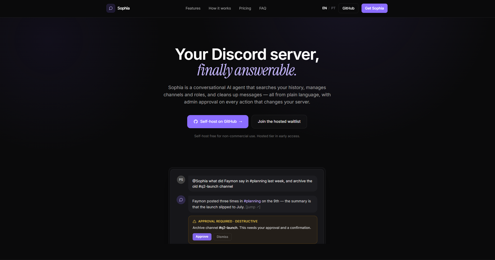

<div align="center">


# Sophia

*A conversational AI agent for Discord that searches your server history and acts on it, with admin approval on every change.*


**[How it works](docs/how-sophia-works.md)** · **[Architecture](docs/architecture.md)** · **[Agent loop](docs/agent-loop.md)** · **[Testing](docs/testing.md)**

</div>

---

Sophia turns your Discord server into something you can talk to. Ask her what happened in any channel, who said what and when, or have her create channels, manage roles, and clean up messages, all in plain language, with a built-in approval system that keeps admins in control.

## 📸 Preview

<div align="center">



<br/><sub>A conversational agent you talk to in plain language, with admin approval on every change. Full overview in <a href="landing/index.html"><code>landing/index.html</code></a>.</sub>

</div>

## ✨ Features

**Conversational AI** — Talk to Sophia naturally through `/talk`, mentions, or replies. She maintains conversation continuity across reply chains and threads.

**Deep Server Search** — Search through your entire Discord history with intelligent retrieval. Sophia indexes messages locally for fast lookups and automatically fetches live history when needed.

**33 Built-in Tools** — From retrieving messages and resolving members to creating channels, managing roles, editing messages, and planning multi-step tasks. The model decides which tools to use based on your request.

**Admin Approval System** — Write actions (create channel, send message, manage roles) require admin approval. Destructive actions (delete channel, clear messages) require approval *plus* confirmation. Multiple destructive actions are batched into a single approval card grouped by Discord category.

**Auto-Approve Mode** — Optionally skip approval for non-destructive write actions when you trust the model.

**Animated Activity Indicators** — Sophia reacts with a cycling emoji sequence while thinking, so you always know she's working.

**Configurable Runtime** — Tune tool-call limits, latency budgets, retrieval depth, approval timeouts, and more through an interactive `/settings` panel. Switch between model profiles on the fly.

**Role-Based Access** — Admin and moderator tiers with rate limiting. Admins get full control; moderators get scoped permissions.

## Quick Start

### Prerequisites

- Node.js 20.12+ (for `process.loadEnvFile()`)
- A Discord bot token
- An [OpenRouter](https://openrouter.ai/) API key

### Install

```bash
git clone https://github.com/zF4ke/sophia.git
cd sophia
npm install
```

### Get an OpenRouter key

Sophia uses [OpenRouter](https://openrouter.ai/) to reach the language models. Bring your own key — Sophia never ships one, and you pay OpenRouter directly for the tokens you use.

1. Sign up at [openrouter.ai](https://openrouter.ai/).
2. Create a key at [openrouter.ai/keys](https://openrouter.ai/keys).
3. Add credit (or start with free-tier model profiles).

You also need a Discord bot token from the [Discord Developer Portal](https://discord.com/developers/applications) (create an application, add a Bot, copy its token).

### Configure

Copy the example file and fill in your values:

```bash
cp .env.example .env
```

```env
DISCORD_TOKEN=your-discord-bot-token
OPENROUTER_API_KEY=your-openrouter-api-key
```

A `.env` file is **required** before the first run — `npm start` reads it on startup and will exit if it is missing. See [`.env.example`](.env.example) for every supported variable (including the optional `BOOTSTRAP_ADMIN_IDS` and `SOPHIA_STORAGE_ROOT`).

### Run

```bash
npm start
```

For development with auto-reload:

```bash
npm run dev
```

## Commands

### Conversation

| Command | Description |
|---------|-------------|
| `/talk` | Start a conversation with Sophia |
| `@Sophia` | Mention Sophia in any message |
| *Reply* | Reply to any Sophia message to continue the conversation |

### Search

| Command | Description |
|---------|-------------|
| `/nth` | Read the N-th historical message from an indexed channel |

### Admin

| Command | Description |
|---------|-------------|
| `/settings` | Tabbed panel to select model and tune runtime |
| `/index` | Manage message indexing — backfill channels/categories, check status, repair |
| `/debug` | Control debug mode and open the logs panel |
| `/superchannels` | Manage protected channels that block destructive actions |
| `/access` | Manage admin and moderator access |
| `/ping` | Health check with latency info |

## Tools

Sophia has **33 tools** organized by capability:

| Category | Tools |
|----------|-------|
| **Retrieval** | `retrieve_messages`, `search_messages` |
| **Discovery** | `list_guild_structure`, `get_guild_context`, `resolve_channel_targets` |
| **Members** | `resolve_member_identity`, `get_member_profile`, `list_members` |
| **Roles** | `get_role_info`, `list_roles`, `create_role`, `edit_role`, `manage_member_roles` |
| **Threads** | `list_threads`, `read_thread_messages` |
| **Utilities** | `measure_text_length`, `evaluate_math` |
| **Write** | `create_channel`, `create_category`, `create_thread`, `move_channel`, `move_category`, `send_message`, `edit_message` |
| **Destructive** | `clear_messages`, `delete_messages`, `delete_channel`, `edit_channel` |
| **Control** | `start_long_task` |
| **Scratchpad** | `plan_update`, `note_add`, `note_list`, `note_clear` |

Write tools require admin approval. Destructive tools require approval + confirmation dialog. Scratchpad tools persist data across context compaction for multi-step tasks.

## Model Profiles

Model profiles are defined in `resources/models/model-profiles.json` and selected in `/settings` (tab **Model**). There are currently 17 profiles spanning Google, OpenAI, DeepSeek, Mistral, MiniMax, xAI, and free-tier models. The default is `gemini25flashlite`.

Pricing shown in `/settings` comes from the `pricing` metadata in `resources/models/model-profiles.json` (values synced from OpenRouter). Add new profiles by editing the JSON file — no code changes needed.

## How It Works

Sophia uses a **while-loop with native function calling**. One unified system prompt gives the model the question, conversation context, and available tools. The model calls tools iteratively and calls `finish` when it has an answer.

There is no separate planner or step selector. The model handles all decisions inside the tool-calling loop. The runtime enforces budgets, guardrails, and approval gates.

**Retrieval pipeline:**
1. Search local indexed Discord messages
2. If evidence is weak, refresh from live Discord history
3. Ingest new messages into the local cache
4. Retry retrieval on the enriched cache

**Conversation continuity** follows reply chains across threads and channels, so `/talk`, mentions, and replies all feel like one continuous conversation.

## Configuration

All runtime tuning is done through `/settings` or `storage/settings.json`:

- **Context retention** — recent turns, channel messages, prior evidence slice
- **Retrieval** — history page size, context window, crawl limits
- **Loop guardrails** — max tool calls (2–30), latency budget (10s–5m), repeated call guard
- **Approval** — timeout duration (30s–5m), auto-approve writes toggle
- **Model profile** — switch model in `/settings` model tab

## Hardcoded Knobs

These values are intentionally hardcoded and where to change them:

- Default protected channel IDs: `src/app/SettingsService.ts` (`DEFAULT_PROTECTED_CHANNEL_IDS`, empty by default — populate per server with `/superchannels`)
- Runtime default values (tool limits, budgets, retrieval defaults, approval timeout): `src/app/SettingsService.ts` (`DEFAULT_SETTINGS.runtime`)
- Context prune threshold ratio (`0.80`): `src/runtime/Runtime.ts` (`CONTEXT_HEADROOM_RATIO`)
- OpenRouter base URL: `src/app/AppConfig.ts` (`openRouterBaseUrl`)
- Model catalog, labels, context and pricing metadata: `resources/models/model-profiles.json`

## Scripts

| Script | Purpose |
|--------|---------|
| `npm start` | Run the bot |
| `npm run dev` | Development mode with auto-reload |
| `npm run check` | Typecheck + run all deterministic tests |
| `npm run typecheck` | TypeScript type check only |
| `npm run test` | Fast deterministic test suite |
| `npm run test:live` | Real-model tests (requires API key) |
| `npm run test:all` | Deterministic + live tests combined |
| `npm run clean` | Reset all storage to defaults |

## Documentation

| Doc | Topic |
|-----|-------|
| [Architecture](docs/architecture.md) | System blocks, runtime flow, storage |
| [Agent Loop](docs/agent-loop.md) | While-loop mechanics, tool model, guardrails |
| [How Sophia Works](docs/how-sophia-works.md) | End-to-end flow, retrieval deep dive, capability composition |
| [Commands & Admin](docs/commands-and-admin.md) | All commands, approval system, access control |
| [Memory & Indexing](docs/memory-indexing.md) | Local cache, retrieval strategy, `/index` commands |
| [Prompt Catalog](docs/prompt-catalog.md) | Active prompts and stable capability names |
| [Feature Stories](docs/feature-user-stories.md) | Concrete acceptance stories for all tools and compositions |
| [Testing](docs/testing.md) | Test strategy, deterministic + live suites, manual tests |
| [UI Guidelines](docs/ui.md) | Response formatting, approval cards, activity indicators |
| [Cleanup & Migration](docs/cleanup-migration.md) | What was removed and why |

## Tech Stack

- **Runtime:** Node.js + TypeScript
- **Discord:** discord.js v14
- **AI:** OpenRouter (OpenAI SDK compatible)
- **Storage:** libSQL (local SQLite)
- **Validation:** Zod
- **Testing:** Vitest

## Project Status

Sophia is functional and actively developed, but honest about its edges: there is no long-term memory or persistent personality yet, retrieval is cache-first with live refresh (not a full memory system), and large-server backfills can take several turns to complete. Self-hosting assumes you are comfortable with Node.js and a `.env` file. If that fits you, it runs today.

## License

[PolyForm Noncommercial 1.0.0](LICENSE) — free for personal, hobby, research, education, and nonprofit use. **Commercial use is not permitted** under this license. See the [LICENSE](LICENSE) file for the full terms.
