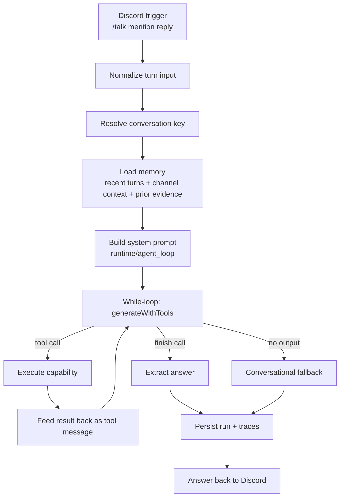
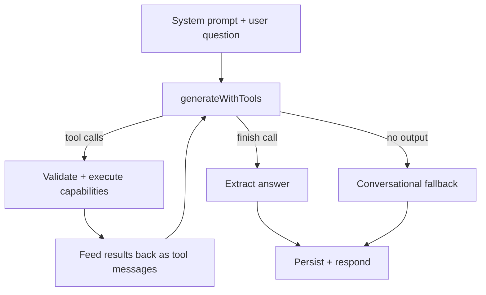
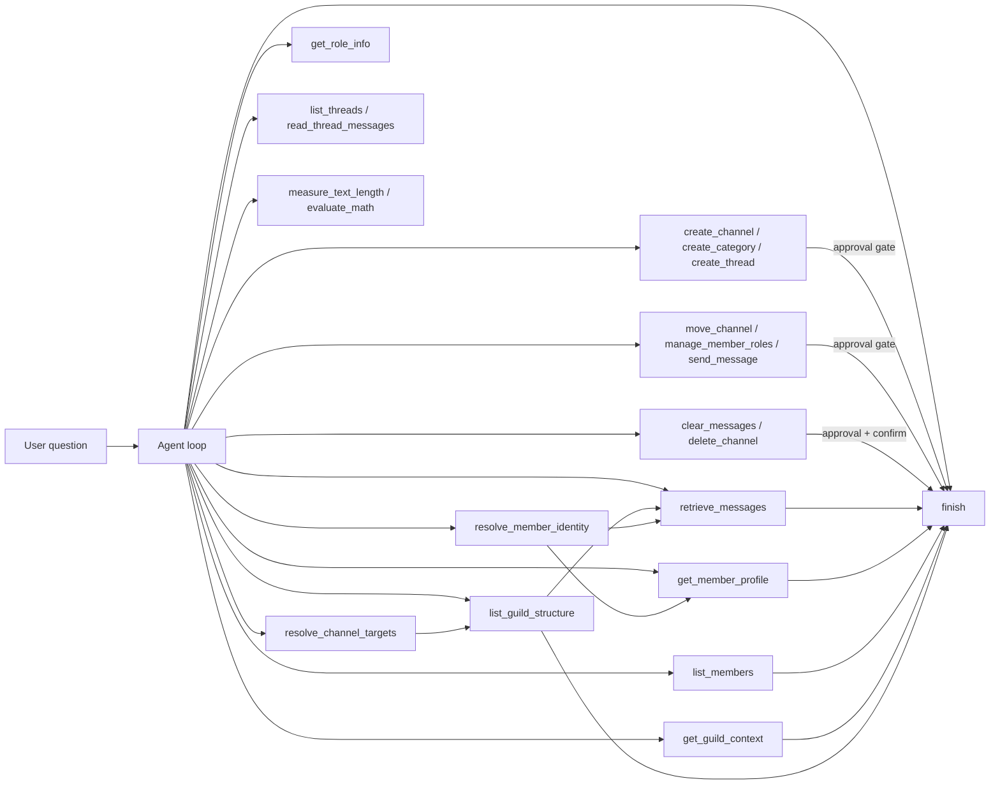
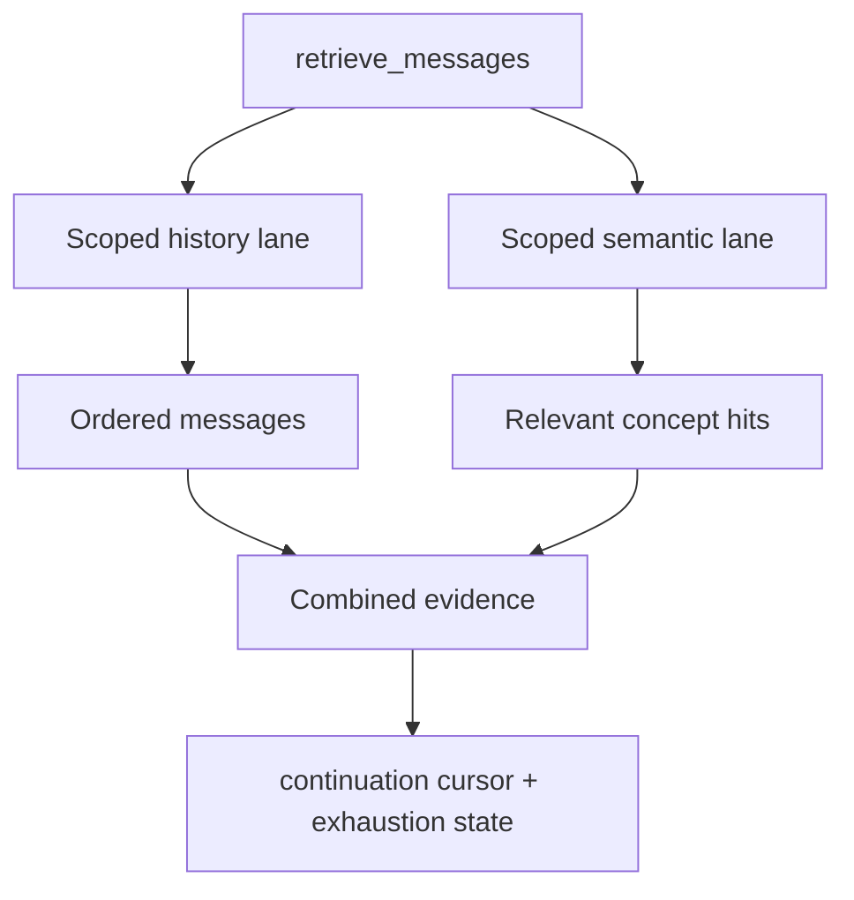
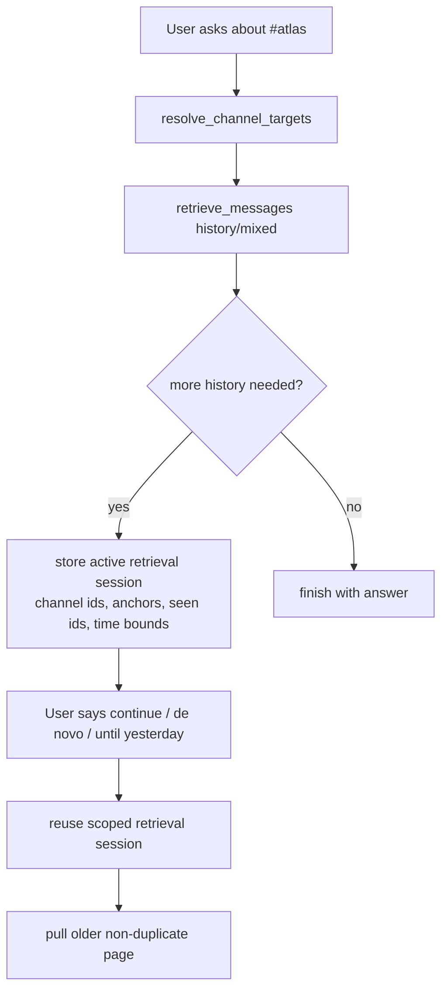
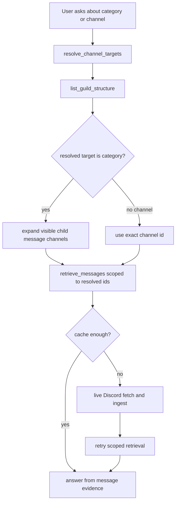

# How Sophia Works

## Overview

Sophia is a conversational-first Discord assistant. She uses a while-loop runtime with native function calling, one conversation system, and one Discord retrieval system.

She currently does four main things:
- keep casual conversation moving
- retrieve Discord evidence when a turn depends on server state
- take actions on the server (create channels, manage roles, send messages) with admin approval
- preserve continuity through conversation state and a local message cache

She does not yet have autonomous long-term memory or a self-updating personality system.

## Core Runtime Flow

1. A command, mention, or reply is normalized into one turn format.
2. Sophia resolves a canonical conversation key.
3. She loads memory: recent turns, channel context, and prior evidence reconstructed from persisted tool runs.
4. She builds a unified system prompt (`runtime/agent_loop`) with all context injected.
5. She enters a while-loop where the model receives the conversation and available tools via `generateWithTools`.
6. The model calls Discord tools to gather evidence, and calls `finish` when it has an answer.
7. She persists runtime and trace data.

If the model never calls `finish` (or produces no output), the runtime builds a conversational fallback from whatever evidence was collected.

### Runtime Diagram



## How Conversation Continuity Works

Sophia tracks continuity in two layers.

### 1. Conversation state continuity

This is short-term execution continuity.

Conversation identity is:
- native Discord thread first
- stored Sophia reply-chain anchor second
- first real anchor message for a new reply chain
- shared channel fallback otherwise

That means:
- `/talk` and a later reply to Sophia can stay in the same conversation
- another participant can join the same reply-chain and stay in the same conversation
- a plain new message in the same channel falls back to the shared channel conversation if there is no reply or thread anchor

### 2. Local Discord message cache

This is retrieval continuity.

Sophia stores observed and fetched Discord messages locally so future searches can be answered faster without always hitting Discord first.

The runtime also reconstructs reusable evidence from recent persisted tool outputs.
That lets follow-up turns answer immediately when the needed scoped message evidence was already retrieved in the same conversation.

## How She Knows Who Is Talking And Who Said What

Sophia keeps requester identity and evidence identity separate.

Requester identity comes from the live Discord trigger:
- for `/talk`, the requester is the interaction user
- for mentions and replies, the requester is the author of the message that triggered Sophia
- the runtime stores the requester's user id and display name in the normalized turn input

Reply identity comes from the referenced Discord message:
- when you reply to a message, Sophia fetches that referenced message
- she stores the referenced message id, author id, author username, author display name, content preview, and jump link
- this lets her know both who is asking and who is being replied to

Evidence identity comes from retrieved Discord data:
- cached or live-fetched message evidence includes author id, author name, channel, timestamp, and jump link
- live member lookups include the resolved member id and display name
- synthesis is supposed to answer from that structured evidence instead of guessing who said what

That distinction matters for user stories like:
- “Who am I?” where the requester must resolve to the speaker, not a random similar member
- “What did Alice say in #reflexoes?” where the answer must come from message evidence authored by Alice
- “What did you think about that?” where Sophia should understand the current requester, the referenced message, and the prior reply-chain context at the same time

## How She Decides What To Do

All decision-making happens inside one while-loop with native function calling. There is no separate planner, step selector, or evidence judge.

### The Agent Loop

The model receives one unified system prompt (`runtime/agent_loop`) that includes:
- the question
- the trigger type
- reply context
- recent turns in the same conversation
- recent ambient channel messages
- prior evidence reconstructed from earlier tool runs
- the capability registry (as native function-calling tools)
- the guild and channel environment

The model then decides on its own whether to call tools or answer directly by calling `finish`.

The runtime enforces only narrow guardrails:
- capability validation (tool name must be in the registry)
- repeated-call guard (blocks exact-same-arguments duplicates)
- tool-call budget and latency budget
- context overflow pruning (old tool outputs pruned when approaching the context window limit)
- refusal prevention for ordinary conversation

### Agent Loop Diagram



### Intent Extraction

There is no separate deterministic intent router in the active runtime anymore. The live loop is model-led: the unified system prompt, prior evidence, recent turns, and available tools are what guide tool choice and argument formation.

Retention is bounded instead of unbounded:
- recent turns and ambient messages are loaded through runtime settings
- prior evidence is reconstructed from a capped number of past tool runs and then sliced again before prompt injection
- old tool outputs are pruned when prompt usage approaches the selected model profile context window
- deep history stays in local storage and is revisited through more tool calls instead of being stuffed into one prompt

### Capability Composition

The model can call any registered capability in any order, any number of times with different arguments. There are 21 tools across read, write, and destructive tiers. Common patterns emerge naturally:



Read this as a capability composer, not a fixed script:
- different questions activate different tool sequences
- composition is bounded by budgets, loop guards, and capability validation
- write/destructive tools pass through the approval gate before execution
- retrieval sessions let repeated turns continue composition statefully

## How `retrieve_messages` Works

`retrieve_messages` is a scoped, history-first reader with multiple evidence lanes.

It can return:
- ordered scoped history messages
- scoped semantic matches from the same channels
- continuation anchors for the next page
- exhaustion state for the current scoped read
- normalized before/after time bounds when the question implies a time window

Semantic paging is deterministic inside one scoped session:
- rank by `totalScore` descending
- break ties by `createdTimestamp` descending
- break remaining ties by `messageId` descending

That cursor is kept in the active retrieval session so "continue" does not reshuffle earlier semantic pages if new messages arrive later.

Default behavior:
- if the user is asking what a channel or category contains, history is the default lane
- semantic matches are supplemental when the user is asking for a specific concept inside that same scope
- continuation reuses the same scoped retrieval session instead of restarting from scratch

Cross-turn continuation is explicit:
- cursor and seen-id exclusion inputs are reused only when the turn intent is continuation-style (`continue`, `de novo`, `again`, etc.)
- fresh follow-up questions in the same scope do not automatically inherit prior exclusions
- this prevents follow-up turns from hiding messages that were just found in the previous turn

For strict scoped retrieval (author and/or time bounded), the retrieval lane has a guarded recovery path:
- if continuation inputs return an empty page, retry once without exclusions
- if still empty and a cursor was applied, retry once without cursor
- emit retrieval diagnostics so debug traces show when a retry recovered evidence

### Retrieval Lanes Diagram



### Continuation Diagram



### Category And Channel Questions



### Why Category Discovery And Retrieval Are Separate

- `resolve_channel_targets` answers: what server object is the user talking about?
- `list_guild_structure` answers: what is around that target and which child channels are visible?
- `retrieve_messages` answers: what is actually being said there?

That separation matters because a category name alone is not enough to explain what a service does. Sophia needs either:
- message evidence from the resolved channels, or
- a clearly-limited answer that says it is based only on server structure

## What She Can Do Today

- answer conversational questions directly (model calls `finish` without using tools)
- answer server questions with cached or live Discord evidence
- continue reply-chain conversations across participants
- remember prior turns within the same conversation
- search cached Discord messages
- automatically fetch more live Discord history when cached evidence is weak
- continue scoped channel history across turns without rereading duplicate messages
- combine ordered history with scoped semantic matches inside the same retrieval capability
- inspect live member profiles including roles, join date, account age, bot status, Nitro/premium, nickname, and avatar
- list all guild members with offset-based pagination (default 20 per page) or filter by name fragment
- resolve exact member, bot, channel, and category ids in the current guild
- distinguish current live guild structure from cached-only remembered entries
- carry short-lived resolved member/channel targets across follow-up turns in the same conversation
- inspect category structure and then retrieve scoped messages from its visible child channels
- inspect role details (members, permissions, color, position)
- list and read thread messages
- measure text length and evaluate math expressions
- create channels, categories, and threads (with admin approval)
- move channels between categories (with admin approval)
- manage member roles — add or remove (with admin approval)
- send messages to channels or threads (with admin approval)
- clear messages from a channel (with admin approval + confirmation)
- delete channels permanently (with admin approval + confirmation)
- batch multiple destructive actions into a single approval card grouped by Discord category
- auto-approve non-destructive write actions when configured
- run `/find` as a specialized retrieval workflow

## Common Wiring Patterns

### 1. Casual conversation

```text
mention/reply -> agent loop -> finish (no tools called)
```

### 2. Exact identity question

```text
agent loop -> resolve_member_identity -> finish
```

### 3. Category or channel explanation

```text
agent loop
-> resolve_channel_targets
-> list_guild_structure
-> retrieve_messages (scoped channel ids)
-> finish
```

### 4. Unindexed channel search

```text
agent loop -> resolve target -> retrieve_messages
-> cache miss -> automatic live Discord fetch
-> ingest local cache
-> retry scoped retrieval
-> finish
```

### 5. Whole-channel or time-bounded reads

```text
agent loop -> resolve target
-> retrieve_messages (history or mixed, optional before/after bounds)
-> continuation anchors stored
-> user says continue / until yesterday
-> retrieve_messages (reuse same scoped session)
-> continue until exhaustion or budget stop
-> finish
```

### 6. Channel creation with approval

```text
agent loop -> user requests channel creation
-> create_channel tool call
-> approval card shown to admin
-> admin approves -> channel created -> finish
-> admin denies -> model receives denial -> finish with explanation
```

### 7. Batch destructive operations

```text
agent loop -> user requests cleanup of multiple channels
-> clear_messages calls queued
-> batch approval card shown (grouped by Discord category)
-> admin approves all/by category -> actions executed -> finish
```

## Limitations

Current limitations:
- no autonomous long-term belief store
- no episodic memory layer
- no self-updating personality module
- no universal capability composer yet
- retrieval is still bounded and cache-first/live-refresh, not a full autonomous memory system
- very large channel reconstructions may still need multiple user turns when the runtime hits budget before exhaustion
