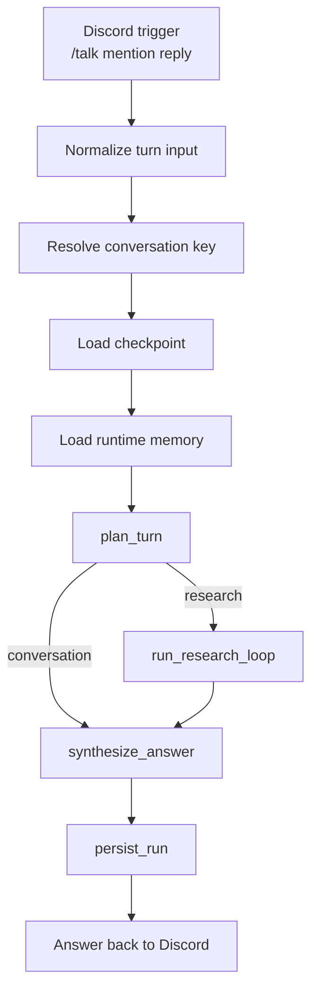
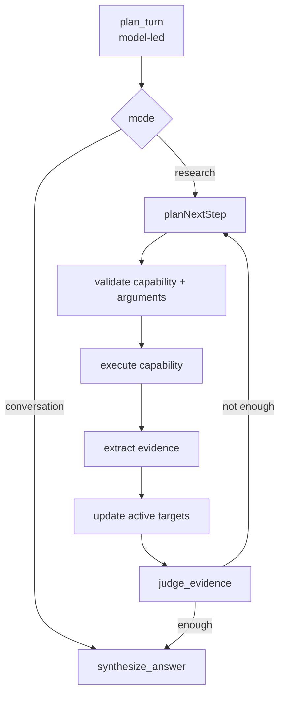
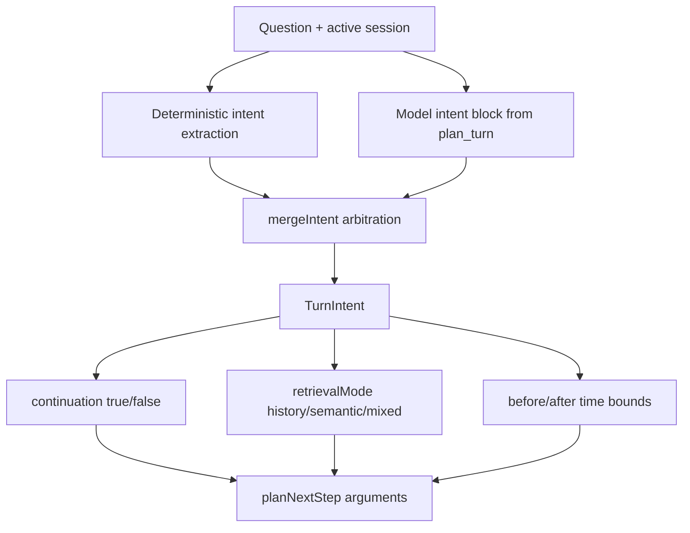
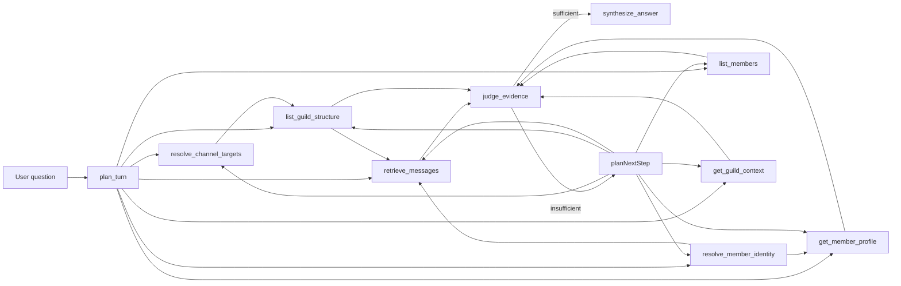
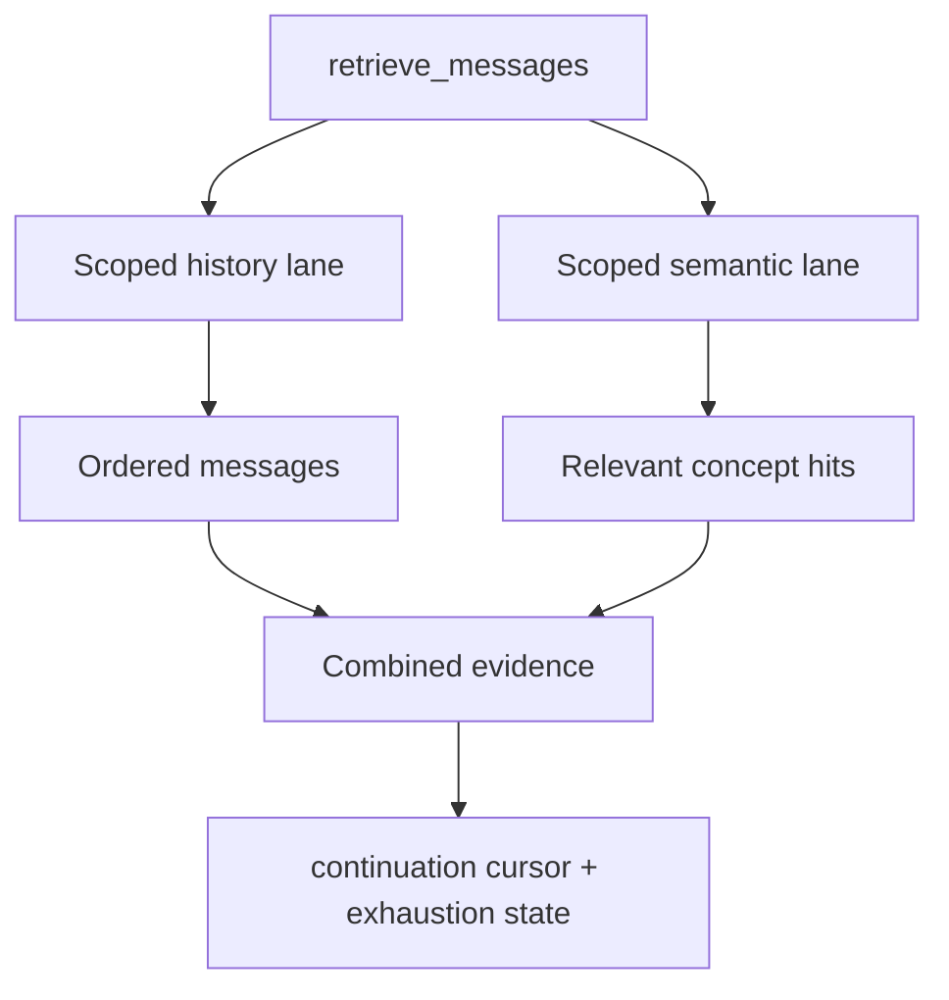
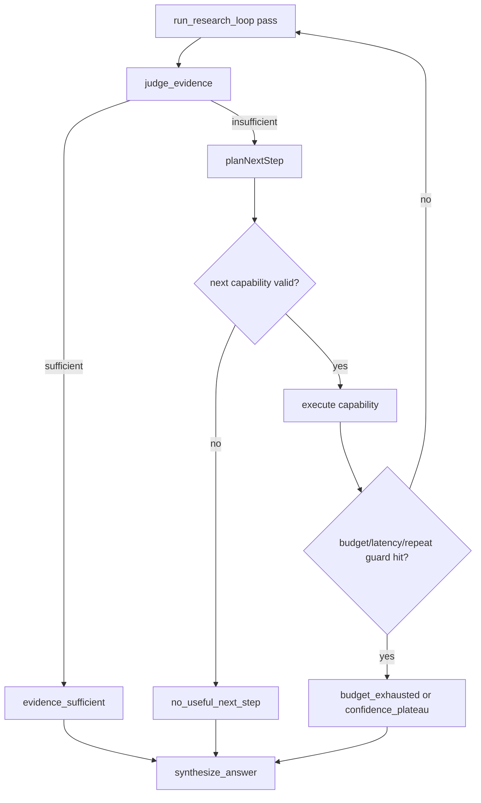
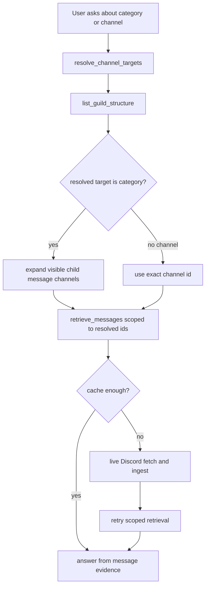

# How Sophia Works

## Overview

Sophia is a conversational-first Discord assistant. She is not a loose prompt harness anymore. She runs as a bounded graph runtime with one conversation system and one Discord retrieval system.

She currently does three main things:
- keep casual conversation moving
- retrieve Discord evidence when a turn depends on server state
- preserve continuity through checkpoints and a local message cache

She does not yet have autonomous long-term memory, a self-updating personality system, or write-side task execution.

## Core Runtime Flow

1. A command, mention, or reply is normalized into one turn format.
2. Sophia resolves a canonical conversation key.
3. She loads checkpoint state for that conversation.
4. She makes cached Discord memory available.
5. She plans whether the turn is direct conversation or bounded retrieval.
6. If retrieval is needed, she runs one capability at a time.
7. She judges whether the evidence is enough.
8. She writes the final answer or asks a targeted follow-up.
9. She persists runtime and trace data.

### Runtime Diagram



## How Conversation Continuity Works

Sophia tracks continuity in two layers.

### 1. Checkpoint continuity

This is short-term execution continuity.

Conversation identity is:
- native Discord thread first
- stored Sophia reply-chain anchor second
- first real anchor message for a new reply chain
- shared channel fallback otherwise

That means:
- `/talk` and a later reply to Sophia can stay in the same conversation
- another participant can join the same reply-chain and stay in the same conversation
- a plain new message in the same channel falls back to the shared channel conversation if there is no reply or thread anchor

### 2. Local Discord message cache

This is retrieval continuity.

Sophia stores observed and fetched Discord messages locally so future searches can be answered faster without always hitting Discord first.

`load_memory` now also reconstructs reusable evidence from recent persisted tool outputs.
That lets follow-up turns answer immediately when the needed scoped message evidence was already retrieved in the same conversation.

## How She Knows Who Is Talking And Who Said What

Sophia keeps requester identity and evidence identity separate.

Requester identity comes from the live Discord trigger:
- for `/talk`, the requester is the interaction user
- for mentions and replies, the requester is the author of the message that triggered Sophia
- the runtime stores the requester's user id and display name in the normalized turn input

Reply identity comes from the referenced Discord message:
- when you reply to a message, Sophia fetches that referenced message
- she stores the referenced message id, author id, author username, author display name, content preview, and jump link
- this lets her know both who is asking and who is being replied to

Evidence identity comes from retrieved Discord data:
- cached or live-fetched message evidence includes author id, author name, channel, timestamp, and jump link
- live member lookups include the resolved member id and display name
- synthesis is supposed to answer from that structured evidence instead of guessing who said what

That distinction matters for user stories like:
- “Who am I?” where the requester must resolve to the speaker, not a random similar member
- “What did Alice say in #reflexoes?” where the answer must come from message evidence authored by Alice
- “What did you think about that?” where Sophia should understand the current requester, the referenced message, and the prior reply-chain context at the same time

## How She Decides What To Do

Sophia decides in stages.

### `plan_turn`

The model first decides whether this is:
- direct conversation
- Discord retrieval

The runtime does not hardcode a large phrase-classification tree anymore. The model sees:
- the question
- the trigger type
- reply context
- recent turns
- recent channel context
- the capability registry
- whether a guild is available

The runtime then applies only narrow guardrails:
- exact-id structural shortcuts
- capability validation (tool name must be in the registry)
- budget limits (max tool calls, max passes, latency)
- repeated-call guard (blocks exact-same-arguments duplicates)
- refusal prevention for ordinary conversation
- a generic fallback ladder if model output is invalid
- short-lived resolved-target carry-over for the active conversation thread

Goal shifting is model-led: when `plan_turn` returns `TurnIntent.continuation=false`, runtime clears active scoped targets and reconstructed carry-over evidence before research continues. This prevents stale scope from a previous objective leaking into the next objective inside the same thread.

`candidateCapabilities` from `plan_turn` is surfaced to `select_next_step` as guidance, not a constraint. The model may freely choose any registered capability based on what it has discovered so far, and may call the same capability multiple times with different arguments when needed.

### Planning And Execution Diagram



### What The Planner Actually Sees

The planner is not wired separately for each user phrasing. The model gets one prompt with:
- the question
- the trigger type
- reply context
- recent turns in the same conversation
- recent ambient channel messages
- current active resolved targets
- the capability registry
- whether guild context exists

It then returns one plan:
- `mode`
- `reason`
- `goal`
- `successCriteria`
- `candidateCapabilities` (initial guidance for the step planner — not a hard constraint)
- `confidence`

### Intent Arbitration Diagram



This is the main composition boundary now:
- deterministic intent remains the reliability guardrail
- model intent fills gaps and broad paraphrases
- merged `TurnIntent` drives continuation, lane preference, and time bounds in step shaping
- when merged continuation is `false`, runtime resets carry-over scope/evidence before research

### `run_research_loop`

If she needs Discord evidence, she runs a bounded loop with registry-driven capabilities.

Current planner-visible capabilities:
- `retrieve_messages`
- `resolve_member_identity`
- `list_guild_structure`
- `resolve_channel_targets`
- `get_member_profile` — returns rich profile evidence: display name, username, nickname, roles, join date, account creation date, bot status, Nitro/premium, pending, and avatar URL
- `list_members` — offset-based pagination (default page size 20); optional `filters` narrows by name/username fragment, omitting it returns all guild members in pages
- `get_guild_context`

For category/channel questions, the common execution pattern is:
1. resolve the target category/channel
2. inspect the matched guild structure
3. retrieve scoped messages from the resolved child channels

This is a common pattern, not a hardcoded sequence. The model may adapt freely based on what it discovers — it can skip steps it doesn't need, call tools in a different order, or call the same tool more than once with different arguments (e.g. `get_member_profile` once per ambiguous member). The runtime provides argument enrichment to help the model execute well but does not redirect tool choices.

The runtime defaults to enough research passes to complete multi-step compositions even when channels are not indexed yet.

### Capability Composition Diagram



Read this as a capability composer, not a fixed script:
- different questions activate different subgraphs
- composition is bounded by budgets, loop guards, and capability validation
- retrieval sessions let repeated turns continue composition statefully

## How `retrieve_messages` Works Now

`retrieve_messages` is no longer a flat search-result tool. It is a scoped, history-first reader with multiple evidence lanes.

It can return:
- ordered scoped history messages
- scoped semantic matches from the same channels
- continuation anchors for the next page
- exhaustion state for the current scoped read
- normalized before/after time bounds when the question implies a time window

Semantic paging is deterministic inside one scoped session:
- rank by `totalScore` descending
- break ties by `createdTimestamp` descending
- break remaining ties by `messageId` descending

That cursor is kept in the active retrieval session so "continue" does not reshuffle earlier semantic pages if new messages arrive later.

Default behavior:
- if the user is asking what a channel or category contains, history is the default lane
- semantic matches are supplemental when the user is asking for a specific concept inside that same scope
- continuation reuses the same scoped retrieval session instead of restarting from scratch

Cross-turn continuation is now explicit:
- cursor and seen-id exclusion inputs are reused only when the turn intent is continuation-style (`continue`, `de novo`, `again`, etc.)
- fresh follow-up questions in the same scope do not automatically inherit prior exclusions
- this prevents follow-up turns from hiding messages that were just found in the previous turn

For strict scoped retrieval (author and/or time bounded), the retrieval lane now has a guarded recovery path:
- if continuation inputs return an empty page, retry once without exclusions
- if still empty and a cursor was applied, retry once without cursor
- emit retrieval diagnostics so debug traces show when a retry recovered evidence

### Retrieval Lanes Diagram



### Continuation Diagram


### Research Stop Conditions Diagram



This is why Sophia can compose reliably without becoming an uncontrolled agent loop:
- she can chain capabilities adaptively
- she always exits through explicit stop reasons
- synthesis gets those stop signals and can disclose partial coverage when continuation remains available

Synthesis now has an additional guard:
- when confidence is `insufficient` and there is no strong message evidence, Sophia must avoid speculative factual/entity guesses
- she should ask a targeted follow-up or propose a concrete next retrieval step instead

### Category And Channel Questions



### Why Category Discovery And Retrieval Are Separate

- `resolve_channel_targets` answers: what server object is the user talking about?
- `list_guild_structure` answers: what is around that target and which child channels are visible?
- `retrieve_messages` answers: what is actually being said there?

That separation matters because a category name alone is not enough to explain what a service does. Sophia needs either:
- message evidence from the resolved channels, or
- a clearly-limited answer that says it is based only on server structure

### `judge_evidence`

After each step, Sophia checks whether she has enough evidence to stop.

### `synthesize_answer`

She then turns the result into the final reply or a best-effort conversational follow-up.

## What She Can Do Today

- answer conversational questions directly
- answer server questions with cached or live Discord evidence
- continue reply-chain conversations across participants
- remember prior turns within the same checkpointed conversation
- search cached Discord messages
- automatically fetch more live Discord history when cached evidence is weak
- continue scoped channel history across turns without rereading duplicate messages
- combine ordered history with scoped semantic matches inside the same retrieval capability
- inspect live member profiles including roles, join date, account age, bot status, Nitro/premium, nickname, and avatar
- list all guild members with offset-based pagination (default 20 per page) or filter by name fragment
- resolve exact member, bot, channel, and category ids in the current guild
- distinguish current live guild structure from cached-only remembered entries
- carry short-lived resolved member/channel targets across follow-up turns in the same conversation
- inspect category structure and then retrieve scoped messages from its visible child channels
- run `/find` as a specialized retrieval workflow

## Common Wiring Patterns

### 1. Casual conversation

```text
mention/reply -> plan_turn(conversation) -> synthesize_answer
```

### 2. Exact identity question

```text
plan_turn(research) -> resolve_member_identity -> judge_evidence -> synthesize_answer
```

### 3. Category or channel explanation

```text
plan_turn(research)
-> resolve_channel_targets
-> list_guild_structure
-> retrieve_messages(scoped channel ids)
-> synthesize_answer
```

### 4. Unindexed channel search

```text
resolve target -> scoped retrieve_messages
-> cache search miss
-> automatic live Discord fetch
-> ingest local cache
-> retry scoped retrieval
-> answer
```

### 5. Whole-channel or time-bounded reads

```text
resolve target
-> retrieve_messages(history or mixed, optional before/after bounds)
-> store continuation anchors + seen ids
-> user says continue / until yesterday / all of them
-> retrieve_messages(reuse same scoped session)
-> continue until exhaustion or budget stop
```

## Limitations

Current limitations:
- no autonomous long-term belief store
- no episodic memory layer
- no self-updating personality module
- no write actions like role changes, thread creation, or DM task workflows
- no universal capability composer yet
- retrieval is still bounded and cache-first/live-refresh, not a full autonomous memory system
- very large channel reconstructions may still need multiple user turns when the runtime hits budget before exhaustion

## Future Evolution

Planned but not yet implemented:
- continuous long-term memory about people, concepts, and projects
- a separate personality layer that does not contaminate factual memory
- bounded write-side tasks with approvals
- a future composer that can combine specialized workflows and general capabilities under one orchestration layer
